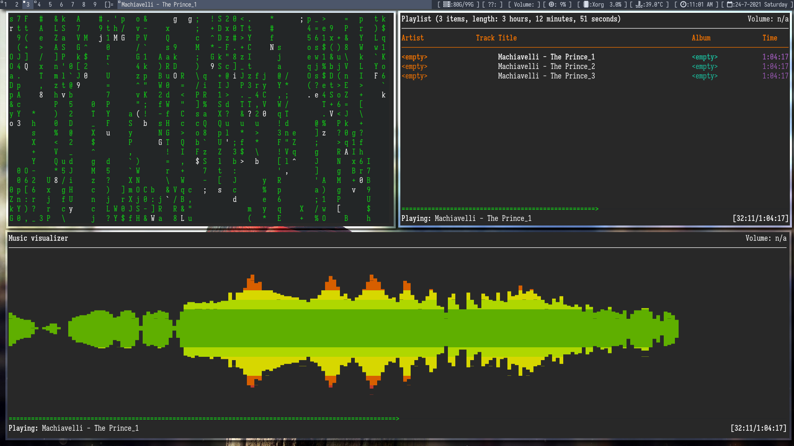
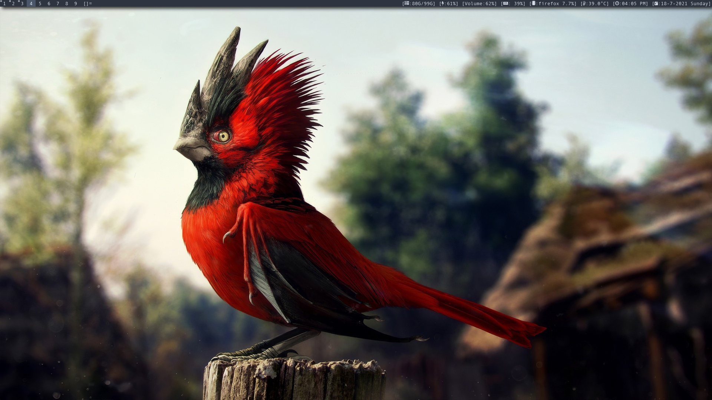
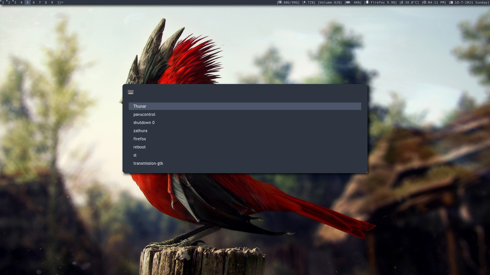

# Dot Files

This repository consists of the dotfiles I use for desktop setup  

## Current setup:
<!--- |Sl.No   | Function | Application used | Config | Remarks 
--->
1. Window manager: [Dwm][dwmLink] [My Patched Verison][dawm]
2. [Wallpaper][WallpaperLink] Credits: [u/wfdownloader](https://www.reddit.com/user/wfdownloader/)
3. Run Application: [Rofi][RofiLink] [config][rofiConfig]
4. Terminal: [Alacritty][AlacrittyLink] [config][alacrittyConfig]
5. Text Editor: [nvim][nvimLink]  [config][nvimConfig]
6. Music Player: [ncmpcpp][ncmpcppLink]
7. Notification manager: [Dunst][dunstLink] [config][dunstrc]
8. Shell: [Bash][BashLink]  [bashrc][bashrc]
9. Color Scheme: [Nodic][NordLink] (Kinda!! I know the wallpaper doesn't go with it but I like the wallpaper so I will change the color scheme in the future)
10. Pdf reader: [zathura][zathuraLink] [config][zathurarc]
11. File Browser: [Thunar][ThunarLink] (I may switch to a tui file manager in the future)
12. Web Browser: [Firefox][FirefoxLink]
13. Statusbar: Default Dwm statusbar [config][statusbar]
14. Statusbar Icons: [Font Awesome 5][FontAwesome5]

### Screenshot1(old):  
  

### Screenshot2:  

### Screenshot3:  

[LINKS]:[]
[dwmLink]:https://dwm.suckless.org/
[WallpaperLink]:https://www.reddit.com/r/wallpaper/comments/o41b92/red_spiky_bird_2560_x_1440/
[RofiLink]:https://github.com/davatorium/rofi
[AlacrittyLink]:https://github.com/alacritty/alacritty
[nvimLink]:https://github.com/neovim/neovim
[ncmpcppLink]:https://github.com/ncmpcpp/ncmpcpp
[dunstLink]:https://github.com/dunst-project/dunst
[BashLink]:https://www.gnu.org/software/bash/
[NordLink]:https://www.nordtheme.com/
[zathuraLink]:https://github.com/pwmt/zathura
[ThunarLink]:https://docs.xfce.org/xfce/thunar/start
[FirefoxLink]:https://www.mozilla.org/en-US/firefox/
[FontAwesome5]:https://fontawesome.com/

[dawm]:https://github.com/DaKidReturns/dawm
[rofiConfig]:rofi/config.rasi
[alacrittyConfig]:alacritty/alacritty.yml
[nvimConfig]:nvim/init.vim
[dunstrc]:dunst/dunstrc
[bashrc]:rcfiles/bashrc
[zathurarc]:zathura/zathurarc
[statusbar]:dwm/scripts/statusbar
