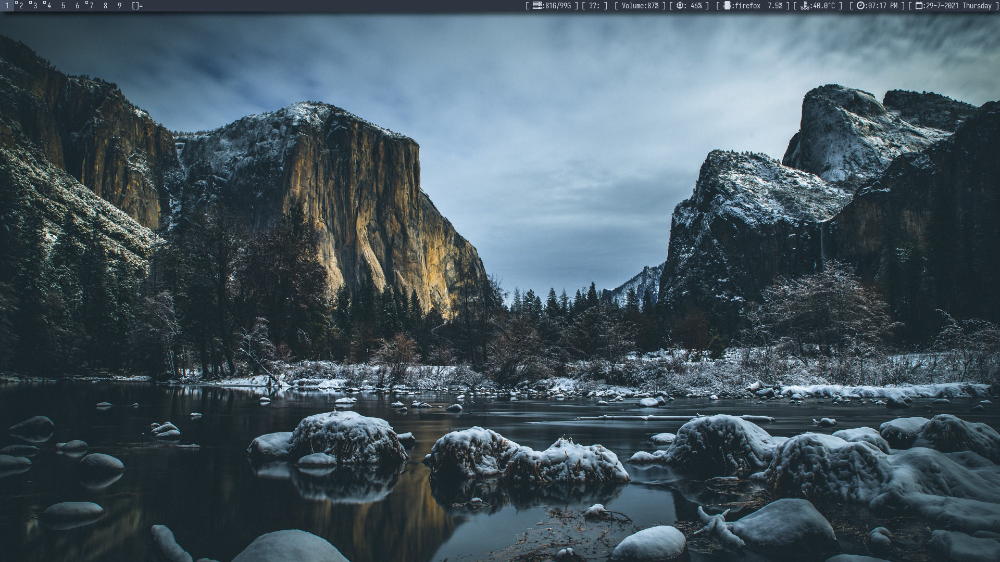
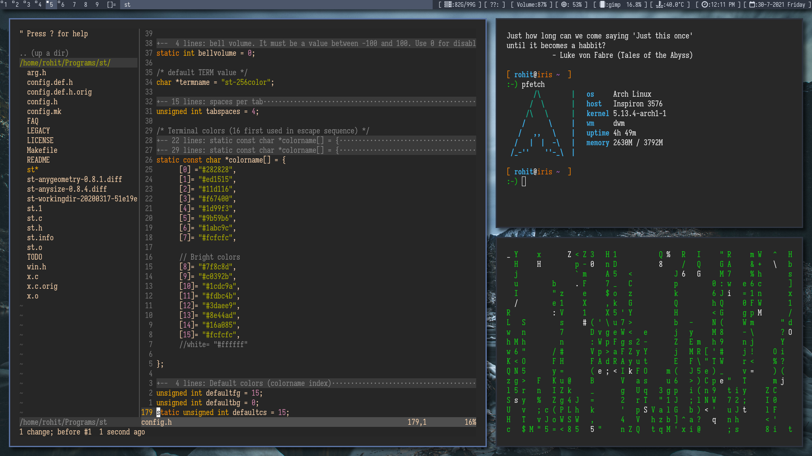
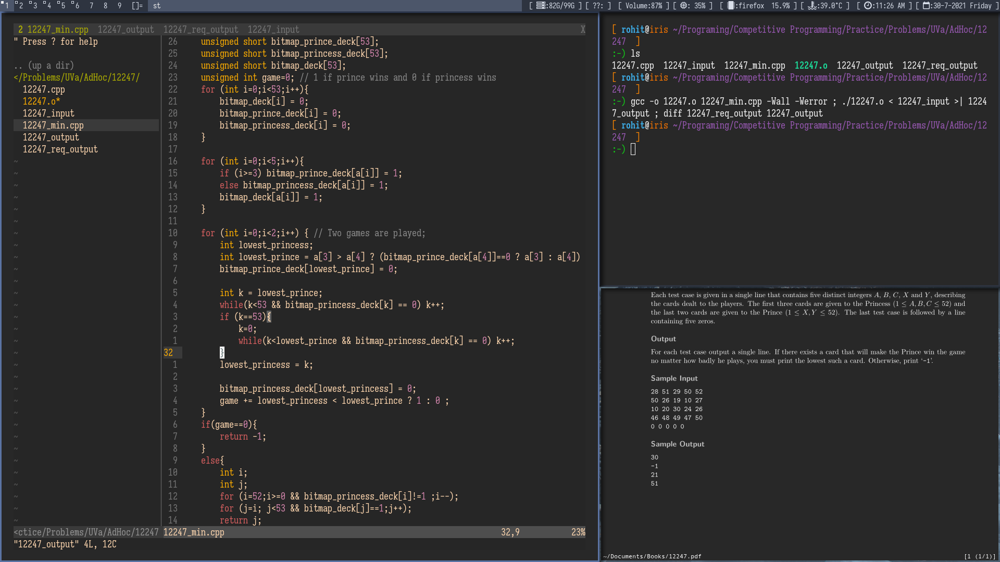
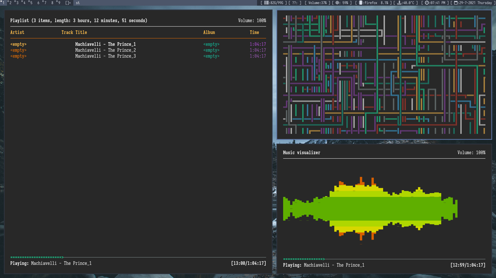

# Dot Files

This repository consists of the dotfiles I use for my desktop setup. The st and the dwm configs are in their respective repos and 
the dmenu is the vanilla version without any patching.  

I am planing to upload a wallpaper repo, where I will upload all the wallpaper with the links to source (if I can find it).

 

### Current setup:
 

|Sl.No| Item           |   Application used                     | Config                    | Remarks |  
 ---| ---              |          ---                           | ---                       | ---     |
|1. | Window manager   | [Dwm][dwmLink]                         | [Personal dwm repo][dawm] |         | 
|2. | [Wallpaper][WallpaperLink] |                              |                           | It is not my picture, I got it from 4chan (i think)        |
|3. | Compositor       | [picom][picomLink]                     | [picom.conf][picomconfig] |         |
|4. | Run Application  | [dmenu][dmenuLink]                     | In the dwm confg.def.h    | (I have switched from rofi to dmenu but I will keep the config in another branch)   |
|5. | Terminal         | [st][stLink]                           | [personal st repo][dast]  | (I have switched from alacritty to st but I will keep the config in another branch) | <!-- [config] [alacrittyConfig] -->
|6. | Text Editor      | [nvim][nvimLink]                       | [init.vim][nvimConfig]    |
|7. | Music Player     | [ncmpcpp][ncmpcppLink]                 |                           |         |
|8. | Notification manager | [Dunst][dunstLink]                 | [dunstrc][dunstrc]        |         |
|9. | Shell            | [Bash][BashLink]                       | [bashrc][bashrc]          |         |
|10.| Color Scheme     |  [Nodic][NordLink]  and [gruvbox][vimGruvbox] for nvim  |          |         |
|11.| Pdf reader       | [zathura][zathuraLink]                 |  [zathurarc][zathurarc]   |         |
|12.| File Browser     | [Thunar][ThunarLink] and [lf][lflink]  | [lfrc][lfrc]              | `lf` as tui file manager (can `lf` show thumbnails of images, it is supported in st? if so please do notify me)|
|13.| Web Browser      |  [Firefox][FirefoxLink]                |                           |         |
|14.| Statusbar        | Default Dwm statusbar                  | [config][statusbar] | It is a custom script, i wrote, no network info though :-\
|15.| Statusbar Icons  | [NerdFont][NerdFont]                   |                           |         |
|16.| Font             | Terminal: [Sarasa Mono font][SarasaFontLink] Gtk: [Ubuntu][UbuntuFontLink]   | | Sarasa is bloat... I would recommend you manually download the ones you want rather than the whole package |

### Screenshot-Empty:  
  

### Screenshot-FakeBusy:  

### Screenshot-Busy:  

### Screenshot-Music Player:  

#### Applications opened in the Screenshot
1. Cool Matrix(1999) like thing: [Cmatrix](https://github.com/abishekvashok/cmatrix)
2. Old Windows screensaver like thing: [pipes.sh](https://github.com/pipeseroni/pipes.sh/)
3. Fetch: [pfetch](https://github.com/dylanaraps/pfetch)
4. [st][stLink]
5. [zathura][zathuraLink]
6. [neovim][nvimLink]
7. [ncmpcpp][ncmpcppLink]

[LINKS]:[]
[dwmLink]:https://dwm.suckless.org/
[picomLink]:https://github.com/yshui/picom
[dmenuLink]:https://tools.suckless.org/dmenu/
[stLink]:https://st.suckless.org/
[nvimLink]:https://github.com/neovim/neovim
[ncmpcppLink]:https://github.com/ncmpcpp/ncmpcpp
[dunstLink]:https://github.com/dunst-project/dunst
[BashLink]:https://www.gnu.org/software/bash/
[NordLink]:https://www.nordtheme.com/
[vimGruvbox]:https://github.com/morhetz/gruvbox
[zathuraLink]:https://github.com/pwmt/zathura
[ThunarLink]:https://docs.xfce.org/xfce/thunar/start
[lflink]:https://github.com/gokcehan/lf
[FirefoxLink]:https://www.mozilla.org/en-US/firefox/
[NerdFont]:https://www.nerdfonts.com/
[SarasaFontLink]:https://picaq.github.io/sarasa/
[UbuntuFontLink]:https://design.ubuntu.com/font/

[dawm]:https://github.com/DaKidReturns/dawm
[dast]:https://github.com/DaKidReturns/dast
[WallpaperLink]:wallpaper/Wallpaper50.jpg
[picomConfig]:picom/picom.conf
[nvimConfig]:nvim/init.vim
[dunstrc]:dunst/dunstrc
[bashrc]:rcfiles/bashrc
[zathurarc]:zathura/zathurarc
[statusbar]:dwm/scripts/statusbar
[lfrc]:lf/lfrc
